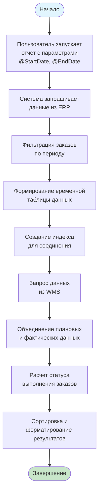
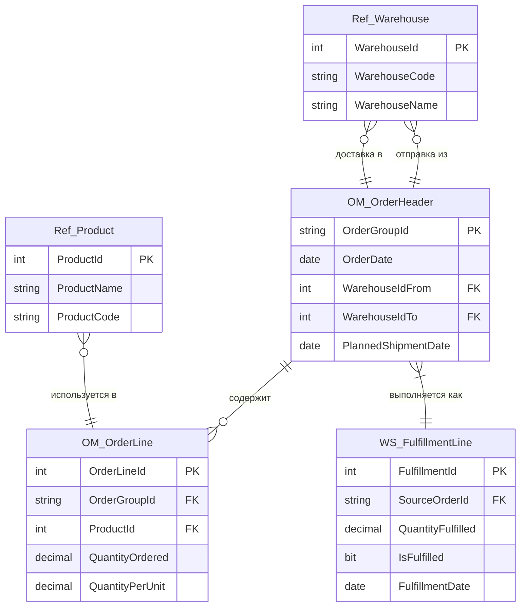

# Портфолио системного аналитика

Добро пожаловать в моё портфолио!


**Техническое задание: Отчет для контроля выполнения заказов**

**ID задачи:** TASK-INT-001  
**Приоритет:** Высокий

**1\. Цель и описание**

Требуется создать консолидированный отчет для контроля выполнения складских заказов. Отчет должен агрегировать данные из двух систем:

- **Система управления заказами (OMS)** - данные о плановых заказах
- **Система управления складом (WMS)** - данные о фактическом выполнении

**Бизнес-требование:** если хотя бы одна товарная позиция в заказе не собрана полностью, весь заказ должен отображаться как невыполненный.

**2\. Источники данных**

**2.1. Система управления заказами (OMS)**

- OM_OrderHeader - заголовки заказов
- OM_OrderLine - позиции заказов
- Ref_Product - справочник товаров
- Ref_Warehouse - справочник складов

**2.2. Система управления складом (WMS)**

- WS_FulfillmentLine - факты выполнения сборки
- **Связь через поле:** WS_FulfillmentLine.SourceOrderId → OM_OrderHeader.OrderGroupId

**3\. Бизнес-логика**

**3.1. Флаг выполнения на уровне позиции:**

- IsFulfilled = 1 - позиция собрана полностью (фактическое количество ≥ плановому)
- IsFulfilled = 0 - позиция не собрана или собрана частично

**3.2. Статус на уровне заказа:**

Статус заказа = MIN(IsFulfilled) OVER (PARTITION BY OrderGroupId)

- MIN = 1 → все позиции собраны → заказ выполнен
- MIN = 0 → хотя бы одна позиция не собрана → заказ не выполнен

**4\. Диаграмма процесса данных**



*Рис. 1. Алгоритм формирования отчета*

**5\. Реализация SQL**
```sql
-- 1. Выборка плановых данных из OMS
SELECT
    CONVERT(VARCHAR, oh.OrderDate, 104) AS OrderDate,
    oh.OrderGroupId,
    wh.WarehouseFromCode,
    wh.WarehouseToCode,
    p.ProductId,
    p.ProductName,
    ol.QuantityOrdered,
    ol.QuantityPerUnit,
    CONVERT(VARCHAR, oh.PlannedShipmentDate, 104) AS PlannedShipmentDate,
    CAST(oh.OrderGroupId AS NVARCHAR(36)) AS OrderGroupId_Key
INTO #TempOrders
FROM OM_OrderHeader oh WITH(NOLOCK)
LEFT JOIN OM_OrderLine ol WITH(NOLOCK) ON ol.OrderGroupId = oh.OrderGroupId
LEFT JOIN Ref_Product p WITH(NOLOCK) ON p.ProductId = ol.ProductId
LEFT JOIN Ref_Warehouse wh WITH(NOLOCK) ON wh.WarehouseId = oh.WarehouseIdFrom
WHERE oh.OrderDate BETWEEN @StartDate AND @EndDate;

-- 2. Оптимизация соединения с данными WMS
CREATE NONCLUSTERED INDEX IX_TempOrders_Key ON #TempOrders(OrderGroupId_Key);

-- 3. Основной запрос с объединением и расчетом статуса
SELECT DISTINCT
    to.OrderDate,
    to.OrderGroupId_Key AS OrderGroupId,
    to.WarehouseFromCode,
    to.WarehouseToCode,
    to.ProductId,
    to.ProductName,
    to.QuantityOrdered AS [Плановое количество],
    CAST(fl.QuantityFulfilled AS DECIMAL(10,3)) AS [Фактически собрано],
    CASE
        WHEN ISNULL(to.QuantityPerUnit, 0) = 0
        THEN NULL -- Товар не упаковывается в стандартные единицы
        ELSE CAST(fl.QuantityFulfilled / to.QuantityPerUnit AS DECIMAL(10,3))
    END AS [Количество единиц упаковки],
    to.PlannedShipmentDate,
    CASE
        WHEN MIN(ISNULL(fl.IsFulfilled, 0)) OVER (PARTITION BY to.OrderGroupId_Key) = 1
        THEN 1
        ELSE 0
    END AS [Статус выполнения заказа]
FROM #TempOrders to
INNER JOIN WS_FulfillmentLine fl WITH(NOLOCK)
    ON fl.SourceOrderId = to.OrderGroupId_Key
ORDER BY
    to.OrderDate,
    to.OrderGroupId_Key,
    to.ProductName;

-- 4. Очистка временных объектов
DROP TABLE IF EXISTS #TempOrders;
```
**6\. Выходная структура данных**

| Поле | Тип данных | Описание |
| --- | --- | --- |
| OrderDate | VARCHAR(10) | Дата создания заказа (ДД.ММ.ГГГГ) |
| OrderGroupId | NVARCHAR(36) | Уникальный идентификатор группы заказов |
| WarehouseFromCode | VARCHAR(20) | Код склада-отправителя |
| WarehouseToCode | VARCHAR(20) | Код склада-получателя |
| ProductId | INT | Внутренний ID товара |
| ProductName | NVARCHAR(255) | Наименование товара |
| Плановое количество | DECIMAL | Количество, заказанное в OMS |
| Фактически собрано | DECIMAL(10,3) | Количество, собранное на складе |
| Количество единиц упаковки | DECIMAL(10,3) | Фактический объем в единицах упаковки |
| PlannedShipmentDate | VARCHAR(10) | Плановая дата отгрузки (ДД.ММ.ГГГГ) |
| Статус выполнения заказа | BIT | 1 - заказ выполнен, 0 - не выполнен |

**7\. Диаграмма связей таблиц**



*Рис. 2. ER-диаграмма используемых таблиц.*

**Примечание к диаграмме:**  
Для таблицы WS_FulfillmentLine применяется бизнес-правило:  
IsFulfilled = 1 если QuantityFulfilled >= плановое количество по позиции

**8\. Параметры и ограничения**

**8.1. Входные параметры:**

- @StartDate - начальная дата периода (обязательный)
- @EndDate - конечная дата периода (обязательный)

**8.2. Форматы:**

- Все даты отображаются в формате ДД.ММ.ГГГГ
- Количественные показатели - 3 знака после запятой

**8.3. Ограничения:**

- Максимальный период выборки - 3 месяца
- Отчет не включает отмененные заказы
- Для заказов без данных в WMS статус = 0 (не выполнен)

**9\. Тестовые сценарии**

| ID теста | Описание | Ожидаемый результат |
| --- | --- | --- |
| TEST-001 | Все позиции заказа имеют IsFulfilled = 1 | Статус заказа = 1 |
| TEST-002 | Одна позиция имеет IsFulfilled = 0, остальные = 1 | Статус заказа = 0 |
| TEST-003 | Нет записей в WS_FulfillmentLine для заказа | Статус заказа = 0 |
| TEST-004 | Заказ с QuantityPerUnit = 0 | Явная проверка через CASE WHEN, единицы упаковки = NULL (товар не упаковывается) |
| TEST-005 | Период без заказов | Пустой результат |

**10\. Требования к производительности**

- Время выполнения: ≤ 20 секунд для периода 90 дней
- Поддержка 10+ параллельных пользователей
- Автоматическое управление временными объектами
- Кэширование частых запросов на уровне БД

**11\. Примечания**

- **Безопасность данных:** Отчет доступен только пользователям с ролью ReportViewer или выше
- **Интеграция:** Отчет может быть использован как источник данных для BI-системы
- **Аудирование:** Все запуски отчета логируются с указанием пользователя и параметров

**Контекст для портфолио:** Реальная задача с предыдущего места работы. Данные и названия систем обезличены для публикации в открытом доступе.
